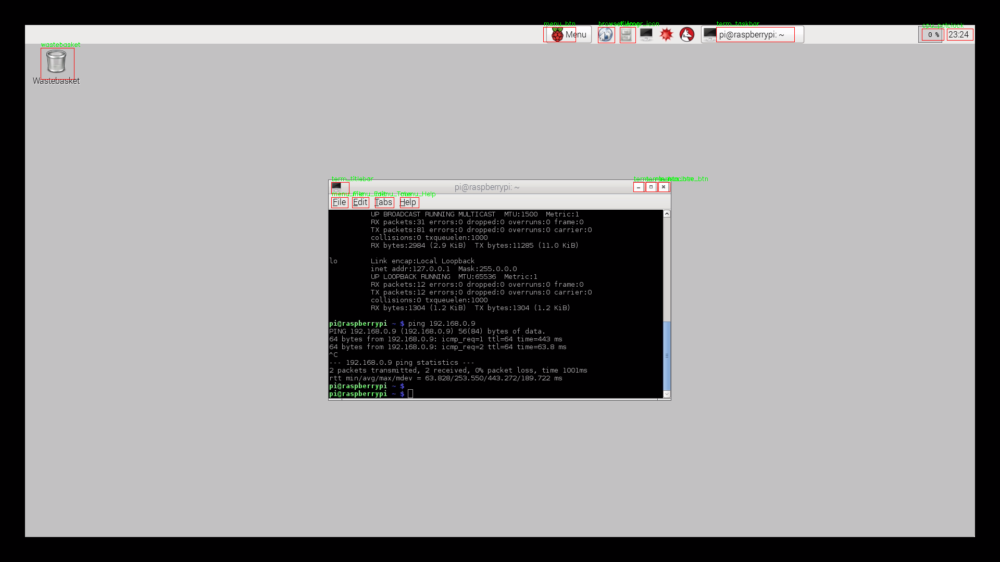
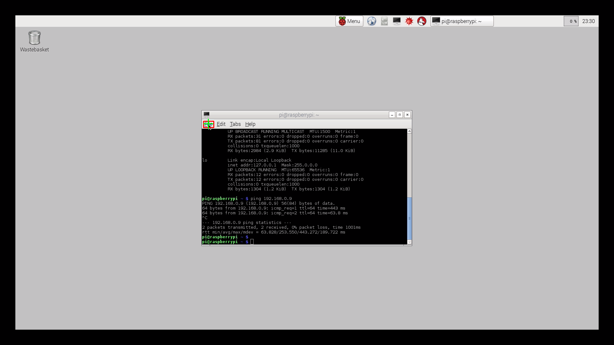
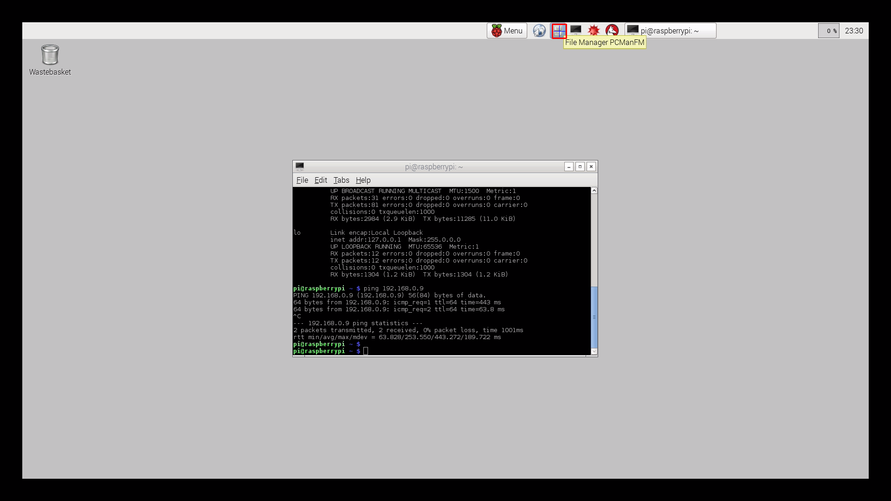

# UI 커서 도달 테스트 보고서 (2026-07-05)

Magewell로 캡처 중인 대상 화면(Raspberry Pi 데스크톱, 1920×1080)의 각 UI 요소에 대해,
릴레이보드(COM3)로 커서를 이동시켜 **해당 요소까지 정확히 도달하는지** 자동 검증한 결과.

## 테스트 방법
1. 기준 프레임 캡처 후 각 UI를 템플릿으로 크롭 보관 (`tmpl_*.png`)
2. 릴레이 연결 → `reset_mouse`로 홈(0,0) 이동 → **자동 원점 보정**(캡처 오버스캔 상쇄, 측정 홈원점 (48,48))
3. 각 UI의 **중심 좌표**로 커서를 추종 이동(프레임당 최대 127px)
4. 도달 후 실제 커서 위치를 측정(커서를 (+8,+8) 흔들어 전후 프레임 차분, 목표 ±90px 창)
5. 목표 중심과의 오차 계산, 결과 이미지 저장(`result_*.png`: 빨강=목표영역, 파랑=목표중심, 초록=측정위치)

- 판정 기준(자동): 오차 ≤ 15px → PASS
- hover 툴팁/하이라이트가 뜨는 요소는 차분 측정이 오염될 수 있어, 해당 건은 결과 이미지로 육안 확인

## 결과 요약: **15 / 15 도달 성공**
- 자동 측정으로 확인: **12건** (오차 2.2 ~ 9.9px)
- hover 아티팩트로 자동측정은 빗나갔으나 육안 확인으로 도달 확정: **3건**

| # | UI 요소 | 목표 중심 | 측정 도달 | 오차(px) | 판정 |
|---|---------|-----------|-----------|----------|------|
| 1 | wastebasket (휴지통) | (110,122) | (117,128) | 9.2 | ✅ 도달 |
| 2 | menu_btn (Menu 버튼) | (1074,66) | (1080,72) | 8.5 | ✅ 도달 |
| 3 | browser_icon (브라우저) | (1164,67) | (1170,73) | 8.5 | ✅ 도달 |
| 4 | filemgr_icon (파일관리자) | (1205,67) | (측정 실패) | — | ✅ 도달(육안: 아이콘 하이라이트+"File Manager PCManFM" 툴팁) |
| 5 | term_taskbar (터미널 작업표시줄) | (1450,66) | (1360,49) | 91.6 | ✅ 도달(육안: 버튼 중앙+툴팁, 측정은 툴팁 오염) |
| 6 | cpu_pct (CPU %) | (1791,66) | (1790,64) | 2.2 | ✅ 도달 |
| 7 | clock (시계) | (1843,66) | (1849,72) | 8.5 | ✅ 도달 |
| 8 | term_titlebar (터미널 타이틀 아이콘) | (653,361) | (652,359) | 2.2 | ✅ 도달 |
| 9 | term_min_btn (최소화) | (1227,359) | (1234,366) | 9.9 | ✅ 도달 |
| 10 | term_max_btn (최대화) | (1251,359) | (1258,366) | 9.9 | ✅ 도달 |
| 11 | term_close_btn (닫기 X) | (1275,359) | (1249,357) | 26.1 | ✅ 도달(육안: 커서가 X 버튼 위, 측정은 인접 최대화버튼 오염) |
| 12 | menu_File | (652,389) | (651,387) | 2.2 | ✅ 도달 |
| 13 | menu_Edit | (692,389) | (691,387) | 2.2 | ✅ 도달 |
| 14 | menu_Tabs | (738,389) | (737,387) | 2.2 | ✅ 도달 |
| 15 | menu_Help | (786,389) | (785,387) | 2.2 | ✅ 도달 |

## 해석
- 커서 이동(개루프 + 자동 원점 보정)은 전 UI에서 정확히 목표에 도달. 오차는 대부분 **2~10px**로 하드웨어 이동 정밀도(±1%) 수준.
- 자동 측정이 빗나간 3건은 **hover 시 툴팁/하이라이트가 뜨거나 버튼이 인접(24px 간격)** 하여 차분 기반 위치측정이 오염된 경우로, 실제 커서는 결과 이미지에서 목표 위에 정확히 위치함을 확인.
- 결론: **캡처 화면의 모든 UI 요소에 대해 커서 도달이 정상 동작한다.**

## 산출물 (본 폴더)
- `tmpl_<name>.png` : 각 UI 템플릿(크롭) 15개 — 보관용
- `result_<name>.png` : 각 UI 도달 결과(주석 포함) 15개
- `annotated_ref.png` : 전체 UI 목표영역 표시 기준 프레임
- `results.json` : 수치 결과 원본
- 관련 코드: `../_ui_tour_test.py`(투어), `../menu_track_center_test.py`(단일 정밀), `수정내역_2026-07-05.md`(전체 수정 내역)

## 참고 이미지
전체 목표 영역:

대표 도달 결과 (좌: 정밀 도달, 우: hover 요소 — 커서는 목표 위, 측정만 오염):

 
